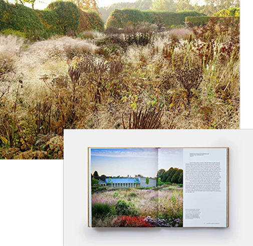
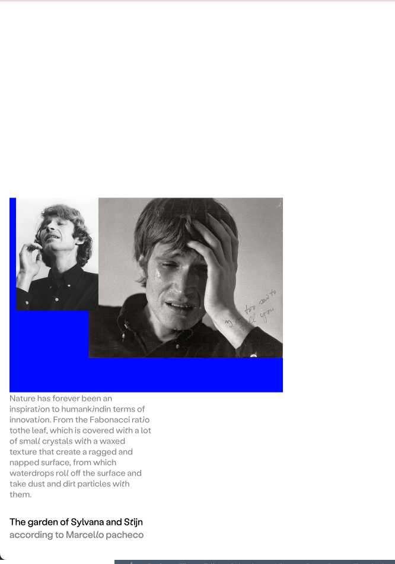

### Handling Media in `media-cont`

The `.media-cont` container is designed to hold **either an image or a video**. The `.video` and `.image` classes are already defined and styled for media to have a width of a parent element.


#### 🖼️ Example Structure for Image:
```html
<div class="media-cont">
    
</div>
```


#### 🎥 Example Structure for Video:
```html
<div class="media-cont">
    <video class="video" autoplay loop>
        <source src="movie.mp4" type="video/mp4">
        Your browser does not support the video tag.
    </video>
</div>
```


Also media layout renders based on the media width. For example:

| Square picture:  |       Horisontal picture:               |
| -------- | ------- |
|  |    |


### Background color implementation

``` css
:root{
--background-color: #fff;
}
```


